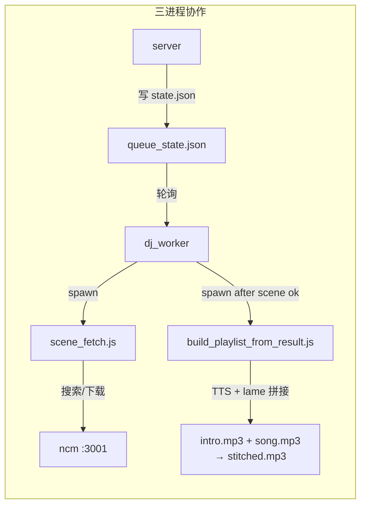
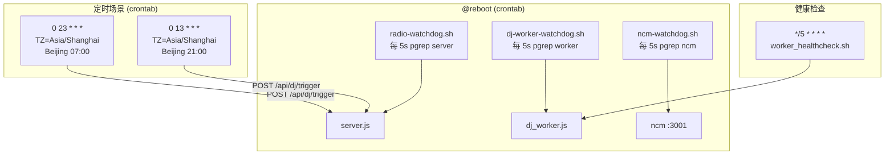

# 192fm · radio_streams

床头广播盒子的 Node.js / Express 服务，部署在 `192.168.8.192:3000`。

单电台模式（`~/Music/网易云收藏/` 30+ 首 mp3），由 DJ Agent 后台自动抓网易云收藏 → LLM 写引言 → TTS → lame 拼接 → ESP32 端通过 `/api/esp` 抽歌播放。admin UI 编排场景、定时、音量；`/temps` 收设备温湿度画图；`/log` 看 API 请求。Settings 页可改天气城市/API key、minimax token、曲库目录。

## 目录

- [部署拓扑](#部署拓扑)
- [进程结构](#进程结构)
- [Web UI 页面](#web-ui-页面)
- [API Endpoints](#api-endpoints)
- [场景任务管线](#场景任务管线)
- [天气统一缓存](#天气统一缓存)
- [温湿度采集](#温湿度采集)
- [设置中心](#设置中心)
- [自动化与开机自启](#自动化与开机自启)
- [文件布局](#文件布局)
- [依赖](#依赖)
- [常见操作](#常见操作)
- [已知坑](#已知坑)

---

## 部署拓扑

```mermaid
graph TB
  subgraph "192.168.8.192 — Ubuntu 22.04, 时区 UTC"
    S[server.js :3000<br/>Express + EJS + lowdb]
    W[dj_worker.js<br/>scene 后台 daemon]
    N[ncm sidecar :3001<br/>NeteaseCloudMusicApi]
    R[radio-watchdog.sh<br/>@reboot]
    D[dj-worker-watchdog.sh<br/>@reboot]
    NW[ncm-watchdog.sh<br/>@reboot]
    C[crontab<br/>@reboot + scene 调度]
  end

  subgraph "客户端"
    ESP[ESP32-C3<br/>SSD1322 OLED]
    BR[Browser<br/>admin / library / temps / log / settings]
  end

  ESP -- "GET /api/esp?t=X&h=Y" --> S
  BR -- "GET/POST /dj, /settings, /library..." --> S
  S -- ".radio_playlist/*state*" --> W
  W -- "node scripts/scene_fetch.js" --> N
  N -- "NCM API" -->|搜索/下载| 网易云
  S -- "QWeather" -->|天气 Now + 7d| 和风天气
```

## 进程结构

| 进程 | 入口 | 职责 | 守护方式 |
|------|------|------|----------|
| **server** | `node server.js` | Web UI + API + 音频 + 天气缓存 | `radio-watchdog.sh` (@reboot) |
| **dj_worker** | `node scripts/dj_worker.js` | 监听 trigger, 跑 scene-fetch+build | `dj-worker-watchdog.sh` (@reboot) |
| **ncm** | `~/ncm-api/app.js` (PORT=3001) | 网易云 sidecar (登录/搜索/下载 URL) | `~/ncm-api/ncm-watchdog.sh` (@reboot) |



## Web UI 页面

| 路径 | 标题 | 用途 |
|------|------|------|
| `/` | 🎧 192电台 | 首页 + 当前歌 |
| `/dj` | 🎧 DJ Agent | 控制台：intro prompts + 场景任务管理 |
| `/library` | 📀 网易云收藏 | 曲目库（按歌单分组） |
| `/temps` | 🌡️ 温湿度图表 | 设备上传的温湿度 + QWeather 基线 |
| `/log` | 📋 API 日志 | 所有 API 请求录制（自动刷新） |
| `/settings` | ⚙️ 设置 | 天气城市/API key, minimax token, 曲库目录 |

所有页面使用共享 `partials/_nav.ejs`，6 项固定顺序：


客户端 JS 自动按 `pathname` 给当前页面高亮 `.active`。

## API Endpoints

### 播放器 / ESP32

| 方法 | 路径 | 说明 |
|------|------|------|
| GET | `/api/esp` | ESP32 拿一首歌 + 接收温湿度 `?t=24.5&h=65` |
| GET | `/api/esp/:deviceId` | 按设备持久化偏好（最近一首、跳过的歌） |
| GET | `/api/time` | 服务器时间 |
| GET | `/api/weather` | 当前天气（走 1min 缓存，返回 daily[]） |
| GET | `/api/volume` | 当前音量 (1-100) |
| POST | `/api/volume` `{volume}` | 设置全局音量 |
| GET | `/api/devices` | 所有已知 ESP 设备 |
| POST | `/api/devices/:id/seek` | 设备 seek 到下一首 |
| POST | `/api/select-next` `{playlist, index}` | 跳到指定 index |
| POST | `/api/reshuffle` | 重洗当前歌单 |
| GET | `/api/tts-intro` | 当前 TTS 介绍 |

### DJ Agent 控制台

| 方法 | 路径 | 说明 |
|------|------|------|
| GET | `/api/dj/status` | 当前 dj_worker 任务状态 |
| POST | `/api/dj/trigger` `{batch, scene, persona?, volume?}` | 触发场景任务 + 立即应用音量 |
| POST | `/api/dj/cancel` | 取消运行中任务 |
| GET | `/api/dj/intro-prompts` | 当前 prompts + scene_hints |
| POST | `/api/dj/intro-prompts` | 保存 prompts |
| GET | `/api/schedule` | 当前定时列表 |
| POST | `/api/schedule` `{items}` | 保存定时（带 volume），自动写 crontab |
| POST | `/api/schedule/install` | 仅重写 crontab |

### 曲库

| 方法 | 路径 | 说明 |
|------|------|------|
| GET | `/api/library` | 所有歌单概览（按 playlist 分组） |
| GET | `/api/library/:id` | 单歌单歌曲列表 |
| GET | `/api/netease/search?q=` | 搜网易云 |
| GET | `/api/netease/play/:id` | 单曲 mp3 流 |

### 温湿度 / 日志

| 方法 | 路径 | 说明 |
|------|------|------|
| GET | `/api/devices/list` | 有数据的设备列表 |
| GET | `/api/readings` | 温湿度历史（时间窗/聚合/分设备） |
| GET | `/api/log` | API 日志 |
| POST | `/api/log/clear` | 清空日志 |

### 设置

| 方法 | 路径 | 说明 |
|------|------|------|
| GET | `/api/settings` | 当前配置（apiKey masked） |
| POST | `/api/settings` | 修改配置（部分更新，空串=清除） |
| GET | `/api/weather/location` | 当前天气城市 |
| POST | `/api/weather/location` | 切换城市 |
| GET | `/api/weather/lookup?q=` | 搜索城市（QWeather 地理编码） |

### 音频流

| 路径 | 说明 |
|------|------|
| `/audio/local/track/<name>` | 本地 mp3（带 Range） |
| `/audio/playlist-stitched/<stamp>/<n>.mp3` | TTS intro + 歌拼接 |
| `/audio/playlist-intro/<stamp>/<n>.mp3` | 单首 TTS intro |

## 场景任务管线

```mermaid
sequenceDiagram
  participant C as crontab / 🏃 手动
  participant S as server.js
  participant Q as queue_state.json
  participant W as dj_worker
  participant SF as scene_fetch.js
  participant N as NCM :3001
  participant LLM as MiniMax-M3
  participant BP as build_playlist.js
  participant TTS as MiniMax TTS
  participant L as lame

  C->>S: POST /api/dj/trigger {scene, volume}
  S->>S: currentVolume = volume; saveState()
  S->>Q: write trigger
  W->>Q: poll → detect trigger
  W->>SF: spawn scene_fetch.js (DJ_SCENE=xxx)
  SF->>N: search NCM playlists
  N-->>SF: song candidates
  SF->>LLM: 20 songs + weatherToday/Tomorrow → system+user prompts
  LLM-->>SF: 20 intro paragraphs
  SF->>N: download MP3s
  SF->>Q: write playlist.json
  SF-->>W: exit 0
  W->>BP: spawn build_playlist_from_result.js
  BP->>TTS: 20 × synthesize intro speech
  TTS-->>BP: 20 × intro.mp3 (32kHz mono)
  BP->>L: lame decode → mono2stereo → lame re-encode (44.1kHz stereo)
  BP->>Q: write stitched/*.mp3
  BP-->>W: done
  W->>Q: mark complete
```

### Intro 解析器（worker 兼容层）

LLM 输出格式不固定，worker 用三段策略自动解析：

1. **JSON array**: `[{"name":"...", "intro":"..."}, ...]`  
2. **Strategy 2 (paragraph attribution)**: 按 `《歌名》` 归 paragraph  
   - Pattern (a) `《name》`（优先）  
   - Pattern (b) bare name 匹配（处理歌名含 `《》` 的情况）  
3. **Strategy 3 (token fingerprint)**: 歌名按 `_ - 空格 ( )` 拆，取最长 token 做 substring  
4. **fallback**: `接下来请欣赏《${name}》` 兜底  

## 天气统一缓存

```mermaid
graph TB
  subgraph "server.js 内部"
    FD[fetchWeatherData<br/>→ QWeather Now + 7d] --> CACHE[_weatherCache<br/>TTL = 60s]
    CACHE --> GW[getWeather]
    GW --> MR[maybeRecordWeather<br/>interval 5min<br/>去重: hourKey]
    GW --> AEW[/api/weather<br/>HTTP handler]
    GW --> TTS[playback / LLM context<br/>(/api/esp)]
  end

  subgraph "dj_worker.js"
    SFW[scene_fetch.js<br/>fetchWeather7d] -->|http://127.0.0.1:3000/api/weather| AEW
  end

  subgraph "外部"
    AEW -->|GET /api/weather| UI[Browser / Temps]
    MR -->|hourly| DB[device_readings.json<br/>device_id=qweather]
  end

  subgraph "配置"
    S[/api/settings POST] -- 清缓存 --> CACHE
    WLOC[/api/weather/location POST] -- 清缓存 --> CACHE
  end
```

**关键规则**：
- 调用 `getWeather()` 时若缓存 < 1 分钟 → 直接返回，**不调 QWeather**  
- 超过 1 分钟 → 异步拉 QWeather + 更新缓存  
- 拉失败 → 返回 stale cache（不抛错，不拖慢播歌）  
- **`/api/weather` 也走缓存**（原来直接调 QWeather，现在共享缓存的同一份数据）  
- worker (`build_playlist_from_result.js`) 的 `fetchWeather7d()` 调用本地服务器 `/api/weather`，不额外调 QWeather  
- 改城市 / API key → 清缓存，下次强制重拉  

**实际 API 调用频率**：每分钟最多 1 次 QWeather 调用（通常每小时 1 次，因为 `maybeRecordWeather` 按 hourKey 去重）。

## 温湿度采集

```mermaid
graph LR
  subgraph "数据入口"
    ESP[ESP32<br/>拉歌时带 t=24.5&h=65] --> AEE[GET /api/esp<br/>或 /api/esp/:deviceId]
    QW[QWeather<br/>每小时自动记录] --> MR[maybeRecordWeather<br/>→ device_id=qweather]
  end

  AEE --> REC[recordReading<br/>设备 IP 自动识别<br/>(strip ::ffff:)]
  MR --> REC

  REC --> LOW[lowdb<br/>config/device_readings.json<br/>每设备 ≤ 1440 条]

  LOW --> UI[/temps<br/>Chart.js + IP 下拉<br/>聚合采样]
```

- `POST /api/readings` 已删除（唯一入口是 `/api/esp/*` 的 query params）  
- 设备不需要额外 HTTP 请求，拉歌时带 `?t=X&h=Y` 即可  
- also accepts `temperature`/`humidity` (long form) 作为 fallback

## 设置中心

```
/settings
├── 📍 天气
│   ├── 当前城市卡片 (名/省份/市/ID)
│   ├── 「更改」→ 搜索城市 (QWeather GeoAPI lookup)
│   └── 🔑 API 配置
│       ├── API Key (password, masked, 可选)
│       └── Host (反代域名)
│
├── 🤖 minimax (LLM + TTS)
│   ├── API Token (password, masked, fallback ~/.mmx/config.json)
│   ├── Anthropic Base / Model
│   └── TTS Base / Model / Voice
│
└── 📀 曲库
    └── stationsDir (路径 + 探测按钮)
```

**数据持久化**: `config/settings.json` (gitignored, per-host) + `DEFAULT_SETTINGS` (hardcoded 在 server.js 与 worker.js)

**安全**:  
- GET `/api/settings` 返回 `apiKey: {set: true|false, preview: "sk-cp-…9IBs"}` — **不回显完整 key**  
- POST 发空串 `= 清除`，发 `…` 串 `= no-op`（防 UI 误把 mask 当 key 发送）  
- 如果 `/api/settings` 里不填 minimax key，自动 fallback 到 `~/.mmx/config.json`

## 自动化与开机自启



- 无 systemd（zulin 无 sudo，user systemd 缺 linger）  
- 所有 `@reboot` 用绝对 `node` 路径 `/home/zulin/.nvm/versions/node/v20.20.2/bin/node`  
- server 启动后自动 reload crontab（`POST /api/schedule` 触发时改写）

## 文件布局

```
radio_streams/
├── server.js                 # Express 主服务（~2600 行，~55 endpoints）
├── package.json
├── scripts/
│   ├── dj_worker.js          # daemon — 监听 trigger
│   ├── scene_fetch.js        # 搜歌 + LLM + 下载
│   ├── build_playlist_from_result.js  # TTS → lame 拼接
│   ├── mono2stereo.js        # mono → stereo 升混
│   ├── generate_playlist.js  # 本地 fallback（无 NCM）
│   ├── scheduled_runner.js   # 旧版 crontab 写表
│   ├── radio-watchdog.sh     # 保活 server
│   ├── dj-worker-watchdog.sh # 保活 dj_worker
│   ├── worker_healthcheck.sh # 5min 健康检查
│   ├── restart_server.sh     # 杀旧 PID → 后台起新
│   └── lib/
│       ├── netease_dl.js     # 网易云下载包装
│       ├── scenes_index.js   # 场景 index
│       └── scene_audit.js    # 场景命中统计
├── views/
│   ├── index.ejs             # 首页
│   ├── admin_dj.ejs          # /dj DJ Agent 控制台
│   ├── library.ejs           # /library 曲目库
│   ├── temps.ejs             # /temps 温湿度
│   ├── log.ejs               # /log API 日志
│   ├── settings.ejs          # /settings 设置中心
│   └── partials/
│       └── _nav.ejs          # 共享导航栏（所有页面 include）
├── config/
│   ├── schedule.json          # 定时任务
│   ├── intro_prompts.json    # LLM prompt + scene_hints
│   ├── settings.json         # 运行时配置（gitignored）
│   ├── weather.json          # 天气城市（gitignored）
│   ├── dj_vibes.json
│   ├── scenes/{morning,night,sport,play}.json
│   └── device_readings.json  # 温湿度 lowdb（gitignored）
├── .radio_playlist/          # 运行时数据（gitignored）
│   ├── worker.log
│   ├── worker.pid
│   └── <stamp>/
│       ├── playlist.json
│       ├── intros/
│       ├── stitched/
│       └── progress.json
├── .gitignore
└── README.md
```

## 依赖

```bash
# 系统
apt-get install -y lame   # MP3 解码/编码（TTS intro 拼接必要）

# Node
npm install
# express ^4.18.0, ejs ^3.1.0, lowdb ^1.0.0
```

> lowdb 替代了 better-sqlite3 — 192 上无 build-essential / python3-dev，原生模块编译失败。

## 常见操作

```bash
# 重启 server（2 秒内）
cd ~/radio_streams && bash scripts/restart_server.sh

# 手动跑 morning 场景（音量 5）
curl -X POST -H "Content-Type: application/json" \
  -d '{"batch":"manual","scene":"morning","volume":5}' \
  http://127.0.0.1:3000/api/dj/trigger

# 看天气城市
curl -s http://127.0.0.1:3000/api/weather/location | python3 -m json.tool

# 改天气城市为临平（无需重启）
curl -s -X POST -H "Content-Type: application/json" \
  -d '{"locationId":"101210104","locationName":"临平","adm1":"浙江","adm2":"杭州"}' \
  http://127.0.0.1:3000/api/weather/location

# 查任务状态
curl -s http://127.0.0.1:3000/api/dj/status | python3 -m json.tool

# 看 worker 日志
tail -f .radio_playlist/worker.log

# 取消任务
curl -X POST http://127.0.0.1:3000/api/dj/cancel

# 列出最近任务
ls -lt .radio_playlist/ | head -5

# git push（192 网络不通 GitHub 443，需 Mac 中转）
git format-patch origin/master..HEAD --stdout > /tmp/relay.patch
# 在 Mac: cd /tmp/192fm-mirror && git am /tmp/relay.patch && git push
```

## 已知坑

- **192 时区 UTC** — 调试 cron 问题第一件事 `date && timedatectl`  
- **lame 必须系统包** — `apt-get install -y lame`，否则 stitching 全挂  
- **9p 死锁** — 一次 stat 太多 mp3 会卡死（单曲库目录没事）  
- **scene_fetch LLM 格式不固定** — 三段 strategy parser 兜底  
- **192 → GitHub 443 超时** — 需 Mac 中转推送（`git format-patch` → `git am`）  
- **`~/.mmx/config.json` 是 fallback** — minimax key 在 Settings 里不改就用 mmx CLI 的 key  
- **POST 改 `/api/settings` 不清 TTS 缓存** — 下次 scene-fetch 才用新 token
```

