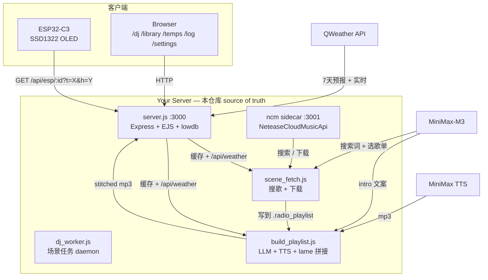

# 安睡小方 Server · Slumber Cube Server

> 床头广播盒子的服务端。把网易云收藏 / 定时场景任务 / LLM 生成的播报词 / TTS / ESP32 拉歌 串成一条全自动链路，再加上一组本地可视化的管理后台。

[](https://nodejs.org)
[](https://expressjs.com)
[](LICENSE)
[](#)

---

## 这是什么

`安睡小方 Server` (Slumber Cube Server) 是一个跑在小服务器上的 Node.js 服务，配套床头 ESP32 设备使用。它每天自动从网易云下载合适的歌 → 让 LLM 写一段贴合天气和场景的播报词 → TTS 合成 → 拼接成可直接播放的 mp3 → 房间里的 ESP32 设备（OLED 屏 + 小喇叭）定时拉一首播。

所有"智能"的部分（选歌、选歌单、写词）都可被替换成固定配置运行，所以即使 LLM / TTS 全部挂掉，整个链路也只会 fallback 到老的"按 score 排序"逻辑继续工作。

## 目录

- [特性](#特性)
- [架构](#架构)
- [快速开始](#快速开始)
- [配置](#配置)
- [场景任务（DJ Agent）](#场景任务dj-agent)
- [API 一览](#api-一览)
- [Web UI](#web-ui)
- [后台进程](#后台进程)
- [常见操作](#常见操作)
- [已知坑](#已知坑)
- [开发](#开发)
- [License](#license)

## 特性

- **DJ Agent** —— 全自动场景任务。每个场景（早安 / 运动 / 夜深了 / ...）定时触发，先用 LLM 生成搜索词、再从候选歌单里挑 1 个、再用 LLM 给每首歌写播报词、再 TTS + lame 拼接。
- **ESP32 拉歌端点** —— `GET /api/esp/<deviceId>` 返回当前应播的歌（mp3 URL + 实时天气）。也接收设备上传的温湿度（`?t=X&h=Y`）。
- **温湿度图表** —— `/temps` 用 Chart.js 画温度/湿度时间线，自动按设备 IP 区分。
- **API 日志** —— `/log` 记录所有 API 请求响应，支持按 IP / method / status 过滤。
- **设置中心** —— `/settings` 在 UI 上改天气城市 / API key / 曲库目录，所有改动落 `config/settings.json` 立即生效。
- **可降级** —— 任何一环失败（QWeather 503 / LLM timeout / 网易云限流）都有 fallback：固定关键词、按 score 排序、缓存里的上一次天气。

## 架构



数据流说明：
- 主进程 `server.js` 同时跑 Web + API + 音频 + 天气缓存。
- 后台 `dj_worker.js` 监听 trigger 文件 → spawn `scene_fetch.js`（搜歌下载）→ spawn `build_playlist.js`（LLM + TTS + 拼接）→ 写 `playlist.json`。
- 主进程读 `playlist.json` 给 ESP32 端点用，**单文件锁 14 小时**（过期自动重建）。

## 快速开始

### 依赖

- Node.js ≥ 20
- 系统包：`lame`（MP3 解码/编码，TTS 拼接时需要）
- 网易云 sidecar：通过 npm 安装 [`NeteaseCloudMusicApi`](https://www.npmjs.com/package/NeteaseCloudMusicApi) 包，跑到 `:3001`（提供登录、搜索、下载 URL 解析）
- 可选：QWeather API key（不配也能用，fallback 到本地温度/湿度）
- 可选：MiniMax API token（不配 → LLM fallback 到固定关键词 + 旧 intro 模板）

```bash
# Ubuntu
sudo apt-get install -y lame

# macOS
brew install lame

# 网易云 sidecar（另开一个终端 / 用 pm2 / 用 systemd / 用下面的 watchdog）
mkdir -p ~/ncm-api && cd ~/ncm-api
npm install NeteaseCloudMusicApi
PORT=3001 exec node node_modules/NeteaseCloudMusicApi/app.js
```

### 启动

```bash
git clone https://github.com/llinzzi/slumbercube-server
cd slumber-cube-server
npm install
node server.js          # 主进程 :3000
node scripts/dj_worker.js   # 场景任务后台（另开终端 / 配 watchdog）
```

打开 `http://localhost:3000/` 看首页；`/dj` 是 DJ Agent 控制台。

### 第一次跑

1. 进 `/settings`：
   - **天气** 选你的城市 / 改 API key
   - **minimax** 填 API token（或用 `~/.mmx/config.json` 里 `mmx auth` 配的那个）
   - **曲库** 改 `stationsDir` 到你放 mp3 的目录
2. 进 `/dj`：
   - 给 `morning` / `evening` 勾上"启用定时" + 调好时间
   - 点 🏃 立即跑一次验证
3. ESP32 配 `http://<server>:3000/api/esp/<deviceId>` 即可拉歌。

## 配置

运行时配置全部在 `/settings` UI 里改，落 `config/settings.json`（gitignored）。默认值 hardcoded 在 `server.js` 的 `DEFAULT_SETTINGS`。

| 分组 | 字段 | 说明 |
|------|------|------|
| **天气** | host | QWeather API 域名（免费注册 https://dev.qweather.com/） |
| | apiKey | 默认值已可工作；自己的 key 优先 |
| | 当前城市 | 在 UI 搜索，存到 `config/weather.json` |
| **minimax** | apiKey | LLM + TTS 共用 token；fallback 到 `~/.mmx/config.json` |
| | anthropicBase | LLM endpoint |
| | anthropicModel | 默认 `MiniMax-M3` |
| | ttsBase / ttsModel / ttsVoice | TTS 三个字段 |
| **曲库** | stationsDir | 单电台模式的 mp3 目录 |

文件级配置（gitignored，需手动改）：

| 文件 | 内容 |
|------|------|
| `config/weather.json` | 当前城市（`{locationId, locationName, adm1, adm2}`） |
| `config/schedule.json` | 定时任务列表（也被 `/dj` UI 写） |
| `config/settings.json` | 运行时配置（API key 等） |
| `config/device_readings.json` | 温湿度历史（lowdb） |
| `data/history_playlists/<scene>.json` | 每个场景已采纳过的 NCM 歌单 ID（去重用） |
| `data/scene_audit/<scene>.jsonl` | 每次场景任务的 audit log（append-only） |

## 场景任务（DJ Agent）

DJ Agent 的核心是 `config/intro_prompts.json` 里的几组 prompt（全部可编辑）：

| 字段 | 触发时机 | 作用 |
|------|----------|------|
| `system_template` / `user_template` | 每次 build playlist | 给 LLM 写每首歌的播报词 |
| `keyword_generator` | scene-fetch 之前 | 让 LLM 基于场景 + 历史生成搜索词 |
| `playlist_selector` | NCM 返回候选后 | 让 LLM 从候选里选 1 个歌单 |
| `scene_hints` | 每次触发 | 场景的搜索关键词 + LLM 标签 + 定时 + 音量 |

完整的 12 步管线：

```mermaid
sequenceDiagram
  participant C as crontab / 🏃
  participant S as server.js
  participant W as dj_worker
  participant SF as scene_fetch
  participant NCM as :3001
  participant LLM as MiniMax
  participant TTS as MiniMax TTS
  participant LAME as lame
  participant F as .radio_playlist

  C->>S: POST /api/dj/trigger {scene, volume}
  S->>S: currentVolume = volume; saveState()
  S->>F: write trigger
  W->>F: poll → detect trigger
  W->>SF: spawn scene_fetch.js (DJ_SCENE=xxx)
  SF->>S: GET /api/weather (cached, 1 min TTL)
  SF->>LLM: 1) 场景 + 历史 → 搜索词 (keyword_generator)
  SF->>NCM: searchPlaylists(kw, 10)  ×  多个 kw
  SF->>LLM: 2) 候选列表 → 选 1 个歌单 (playlist_selector)
  SF->>NCM: playlist.detail → 歌单曲目
  SF->>NCM: download url × 20
  SF->>F: playlist.json
  W->>BP: spawn build_playlist_from_result.js
  BP->>LLM: 3) 20 首歌 + weather → 20 个 intro (batch)
  BP->>TTS: 4) intro × 20 → mp3
  BP->>LAME: 5) decode → mono2stereo → re-encode (44.1kHz)
  BP->>F: 6) stitch: intro+mp3 → stitched/<n>.mp3
  BP->>F: current.json 原子切换
```

Intro 解析器（worker 兼容层）：LLM 输出格式不固定，worker 用三段策略自动解析：
1. **JSON array**: `[{"name":"...", "intro":"..."}, ...]`
2. **Strategy 2**: 按 `《歌名》` 归 paragraph
3. **Strategy 3**: token fingerprint
4. **fallback**: `接下来请欣赏《${name}》`

## API 一览

### 播放器 / ESP32

| 方法 | 路径 | 说明 |
|------|------|------|
| `GET` | `/api/esp/:deviceId` | 拉下一首歌 + 实时天气；`?t=X&h=Y` 顺带传温湿度 |
| `GET` | `/api/time` | 服务器时间 |
| `GET` | `/api/weather` | 实时天气（走 1 min 缓存） |
| `GET` | `/api/volume` / `POST /api/volume` | 当前音量 (1-100) |

### DJ Agent

| 方法 | 路径 | 说明 |
|------|------|------|
| `POST` | `/api/dj/trigger` | 触发场景任务 `{batch, scene, volume?}` |
| `POST` | `/api/dj/cancel` | 取消运行中任务 |
| `GET` | `/api/dj/status` | 当前 worker 任务状态 |
| `GET` / `POST` | `/api/dj/intro-prompts` | 编辑 LLM prompt 模板 |
| `GET` / `POST` | `/api/schedule` | 定时任务列表 |

### 曲库 / 设置

| 方法 | 路径 | 说明 |
|------|------|------|
| `GET` | `/api/library` | 所有歌单概览（按 playlist 分组） |
| `GET` | `/api/library/:id` | 单歌单歌曲列表 |
| `GET` | `/api/netease/search?q=` | 搜网易云 |
| `GET` / `POST` | `/api/settings` | 读写运行时配置（apiKey masked） |
| `GET` / `POST` | `/api/weather/location` | 城市切换 |
| `GET` | `/api/weather/lookup?q=` | 城市搜索（QWeather 地理编码） |

### 温湿度 / 日志

| 方法 | 路径 | 说明 |
|------|------|------|
| `GET` | `/api/devices/list` | 设备列表（按 IP 区分） |
| `GET` | `/api/readings` | 温湿度历史 |
| `GET` / `POST` | `/api/log` | API 日志 |

### 音频

| 路径 | 说明 |
|------|------|
| `/audio/local/track/<name>` | 本地 mp3（带 Range） |
| `/audio/playlist-stitched/<stamp>/<n>.mp3` | intro+歌 拼接好的 mp3 |
| `/audio/playlist-intro/<stamp>/<n>.mp3` | 单首 TTS intro |

## Web UI

| 路径 | 标题 | 说明 |
|------|------|------|
| `/` | 🎧 安睡小方 | 首页 + 当前歌 + 设备选择 |
| `/dj` | 🎛 DJ Agent | 场景任务管理 + LLM prompt 编辑 |
| `/library` | 📀 网易云收藏 | 曲目库（按歌单分组） |
| `/temps` | 🌡 温湿度图表 | 多设备温度/湿度时间线 |
| `/log` | 📋 API 日志 | 所有 API 请求录制（IP/URL/method/status 筛选） |
| `/settings` | ⚙ 设置 | 天气城市 / API key / 曲库目录 |

## 后台进程

无 systemd（无 sudo），用 crontab `@reboot` 起 3 个 watchdog：

```cron
@reboot /path/to/ncm-api/ncm-watchdog.sh >/dev/null 2>&1
@reboot /path/to/slumbercube-server/radio-watchdog.sh >/dev/null 2>&1
@reboot /path/to/slumbercube-server/dj-worker-watchdog.sh >/dev/null 2>&1
```

每个 watchdog 每 5 秒 `pgrep`，死了就重启。手动起也可以：

```bash
node server.js
node scripts/dj_worker.js
PORT=3001 node node_modules/NeteaseCloudMusicApi/app.js  # 网易云 sidecar
```

## 常见操作

```bash
# 重启主进程
cd ~/slumbercube-server && bash scripts/restart_server.sh

# 重启 worker
pkill -9 -f dj_worker.js && sleep 5  # watchdog 自动拉起

# 手动跑 morning 场景（音量 5）
curl -X POST -H "Content-Type: application/json" \
  -d '{"batch":"manual","scene":"morning","volume":5}' \
  http://127.0.0.1:3000/api/dj/trigger

# 取消任务
curl -X POST http://127.0.0.1:3000/api/dj/cancel

# 看 worker 日志
tail -f .radio_playlist/worker.log

# 查任务状态
curl -s http://127.0.0.1:3000/api/dj/status | python3 -m json.tool

# 调试 LLM prompt（不重跑场景）
python3 scripts/intro-tester.py --playlist .radio_playlist/<stamp>/playlist.json

# 看 LLM 选歌历史
cat .radio_playlist/data/scene_audit/morning.jsonl | tail -3 | python3 -m json.tool
```

## 已知坑

- **192 时区 UTC** — 所有日期/时间字段先转 `Asia/Shanghai` 再格式化。早期版本直接用 `Date.getDate()` 会跨天错位。
- **lame 必须系统包** — `apt-get install -y lame`，否则 stitching 全挂。
- **9p 死锁** — 一次 stat 太多 mp3 会卡死（单曲库目录没事，几千首内 OK）。
- **scene_fetch LLM 格式不固定** — 三段 strategy parser 兜底。
- **192 → GitHub 443 超时** — push 需 Mac 中转（`git format-patch` → `git am`）。
- **`/api/esp` 响应必须 < 2KB** — ESP32 malloc 2KB buffer，lean weather 字段（不带 daily[]）刚好 240B。
- **POST `/api/settings` 不清 TTS 缓存** — 下次 scene-fetch 才用新 token。

## 开发

```bash
# 全栈语法检查
node -c server.js
for f in scripts/*.js scripts/lib/*.js; do node -c "$f"; done

# 跑 LLM 历史 audit
tail -1 .radio_playlist/llm_history.jsonl | python3 -m json.tool
```

主要文件位置：

- `server.js` (≈3000 行) — Web + API + 音频 + 天气缓存
- `scripts/dj_worker.js` — 场景任务后台
- `scripts/scene_fetch.js` + `scripts/scene_playlist_search.js` — 搜歌
- `scripts/build_playlist_from_result.js` — LLM + TTS + lame 拼接
- `scripts/lib/llm_helper.js` — 共享 LLM 调用
- `scripts/lib/netease_dl.js` — 网易云下载
- `views/partials/_nav.ejs` — 共享导航栏
- `views/admin_dj.ejs` — DJ Agent 控制台 (最大页面)

### 提交规范

每个 commit 只做一件事，commit message 第一行用 `动词 名词` 形式（如 `Fix /api/esp returning empty weather`），下面写 1-2 段 `why` 而不是 `what`。

### 加一个新的 endpoint

1. `server.js` 里 `app.get/post(...)`
2. 如果数据要从 `.radio_playlist/current.json` 取 → 用 `loadCurrentPlaylist()`
3. 如果会泄露 API key → 通过 `maskKey()` 返回 masked 形状

## License

[MIT](LICENSE) — Copyright (c) 2026 llinzzi
